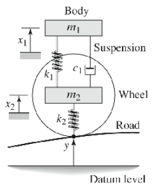

#Example Train-Bridge
This example consists of 2 subsystems ( Bridge, Train). Both models were build and encoded to .fmu files based on the FMI Standard 2.0.3. The language of this 
### Train model
>This model consists of a 2DOF System with. The illustration below depicts the system of this model. Just to clarify, the $k_2$ spring does not exist. As a result, the imposed displacement to the wheel ($m_2$) is the deformation of the bridge model added to the deformation of the train rails which is known as the rail irregularity.

### Bridge Model
> For the bridge model OpenSees Python library were utilized. All the necessary data are available in the bfmu.py file. As it is mensioned earlier OpenSees is the solver of the bridge model.

### Concluding Remarks
The objective in this example was to test the developed library that is able to create trustworthy fmu models. Moreover, this example will be reproduced with more features.